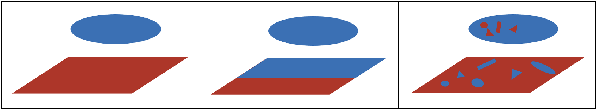

# Surface Simulation

This program is surface interaction simulator,
reformed and improved based on <https://github.com/stanlo229/surface-simulation-goh-lab> with permission.

## Overview of the program

1. This program asked the user to input some parameters shown later.
2. Based on the user input, film and bacteria will be generated domain on it, the number of each depends on the simulation type.
3. For energy scan mode, the program will use bacteria to scan the film surface and calculate the energy. (For now, will change in the future)  
4. For dynamic simulation mode, the program will move bacteria and stick/unstuck bacteria on the surface.
5. Result will be saved into an Excel file.

## Installation of Python and Required Packages

1. Install python

   * Open <https://www.python.org/> to download the python and install.

2. Install required package

   * Using following command to install all required package automatically

    ```bash
    python -m pip install -r RequiredPackage.txt
    ```

    If failed, then install all packages manually as below shows

   * Open RequiredPackage.txt and use pip to install all requirement package manually, command shows below, XXX replaced by the package name:

    ```bash
    pip install XXX
    ```

   * If you do not have pip installed, make sure you download Python 3 from the official
      website: <https://www.python.org/downloads/>

## Run the program

### prerequisite

1. The description of all parameter want user to input is illustrated in the file HelpFile.txt under folder TextFile.  
User can open and read the meaning of all parameter put in at here or type help or click help when running the program depends on how you run the program.  
The format of HelpFile is: VariableName : Description

2. The special restriction of some variables are listed in the file SpecialRequirement.txt under folder TextFile.  
The message listed in the file will appear on the screen if you type wrong parameter. The format of SpecialRequirement is :
VariableName: Restriction : Checking condition  
User don't need to understand the checking condition at the end and should NOT change it.

3. The parameter change from the old version is listed in the file OldNewTransfer.txt.  
If need to reproduce the result from the old version, please look at this file.

### Parameters illustrate

   Can also check files in TextFile folder for more informations

1. Log parameters (set at the beginning of the simulation):

   * writeImage: boolean, generate result image or not

   * recordLog: boolean, generate log file or not
   * writeAtLast: boolean, generate all log file after simulation is done or not
   * printMessage: boolean, show running message in the terminal or not

   <br/>

2. Simulator parameters:

   * SimulationType: int,  can be 1 or 2 or 3 for now, 1 for one surface react with one bacteria once, 2 for One surface, multiple different bacteria, every bacteria scan the surface once, 3 for Multiple different surfaces, one bacteria, bacteria scan every surface once. Different bacteria/surface means the domain generation seed is different, not the size different
   * trail: int, trail number
   * dimension: int, dimension of simulation, only can be 2 or 3, for dynamic simulation, only can be 3
   * simulatorType: int, 1 for energy scan mode and 2 for dynamic simulation mode
   * interactType: str, only can be "DOT" or "CUTOFF". "DOT" mode only calculate the interact between bacteria and points directly under bacteria on the surface, "CUTOFF" calculate interact for points in a given range
   * cutoff: int, indicate how large range want to consider for calculating enenrgy, only work in "CUTOFF" mode
   * importSurfacePath: str, a path to a .npy file contain the information of a surface
   * preparedSurace: ndarray, a ndarray record the surface read from the importSurfacePath

   <br/>

3. Film & Bacteria parameters:

   * filmSeed/bacteriaSeed: int, random seed for generate domain on the surface/bacteria
   * filmNumber: int, number of film, only when simulation type is 3 this can be more than one, otherwise only can be 1
   * bacteriaNumber: int, number of bacteria use for simulation, for energy scan mode this number should be small, details list in SimulationType above, for dynamic simulation mode this number is how many bacteria put on the suface and shoud be large
   * filmSurfaceSize/bacteraSize: Tuple, record the dimension of surface, for 2D: (length, width), for 3D: (length, width, height)
   * filmSurfaceShape/bacteriaSurfaceShape: str, shape of film surface can be: "RECTANGLE", shape of bacteria can be "RECTANGLE" for 2D and "CUBOID", "SPHERE", "CYLINDER", "ROD" for 3D
   * filmSurfaceCharge/bacteriaSurfaceCharge: +1 or -1, +1 for positive charge and -1 for negative charge
   * filmDomainSize/bacteriaDomainSize: Tuple, size of domain on the surface, (length, width)
   * filmDomainShape/bacteriaDomainShape: str, shape of domain, can be: "SINGLE", "CROSS", "CIRCLE", "DIAMOND", "OCTAGON"
   * filmNeutralDomain/bacteriaNeutralDomain: boolean, indicate generate domain without charge, i.e. value of this point is 0
   * filmDomainConcentration/bacteriaDomainConcentration: float, between 0 to 1, indicate domain concentration on the film
   * filmDomainChargeConcentration/bacteriaDomainChargeConcentration: float, between 0 to 1, indicate the charge concentration on the domain
   * interval_x/interval_y: int, interval is how many times scan on x/y direction

   <br/>

4. Dynamic simulation parameters:

   * probabilityType: str, type of probability, can be "SIMPLE" with a given value, "POISSON" with a given Lambda value, "BOLTZMANN". __For now only support "SIMPLE" which is a fixed value__
   * timestep: int, how many step of dynamic simulation
   * bacteriaMovementSeed: int, seed for generate bacteria movement path
   * unstuck: boolean, indicate bacteria can become free if stuck
   * unstuckProbability: float, only can between 0 to 1, indicate the probablility of stuck bacteria becomes free
   * generateDomain: boolean, indicate generate domain on bacteria or not

   <br/>

### Program Structure


<br/>

   All program files are under corresponding folders with proper name
<br/>

### Running simulation

1. Run by user input in command line:

   * In the terminal with correct directory of program code, type in

   * (For macOS)

     ```bash
      python3 RunSimulationCmd.py
      ```

   * (For Windows)

      ```bash
      python3.exe RunSimulationCmd.py
      ```

   * Follow the promotion in the terminal to type in the corresponding value to start the simulation.

2. Run by script

   * (For macOS)

      ```bash
      python3 RunSimulationScript.py
      ```

   * (For Windows)

      ```bash
      python3.exe RunSimulationScript.py
      ```

### Result

* Numberical result of the simulation will be saved in the folder Result in energy folder or dynamic folder

* Figure result of the simulation will be saved in the folder Image in the energy folder or dynamic folder if select to generate image

### Extra Info

* For more info, don't hesitate to contact me at __Jiaqi.gong@mail.utoronto.ca__ with email title "Surface Simulation Troubleshooting"
  
* The log of running will be saved under folder Log. If error happen, user may look at the log file to figure out the error. __Complete log file usually very large__
  
* Time alayze file under Time Analyze folder can be used to analyze the time need for program

* CCScript contains script used to run code on Compute Canada server

* CombineResult folder and DynamicTimestepResults folder contains files can be used to combine data in various xlsx files into one or sort result, instructions are in each file

## Overall goal of simulation

1. Purpose
   The overarching goal of this project is to determine how bacteria, yeast, and cells interact with surfaces/films. Due to the small scale of these organisms, distribution of positive, negative, and neutral charges would often affect the interaction between these microorganisms and the film.

2. Introduction to the simulation
   Let's consider the image above. A uniformly charged film and bacteria would give a pretty simple interaction. Similarly, if the charges are patterned, the interaction would also be pretty easy to predict. However, when the charges are scattered on both the film and bacteria, the interaction can be hard to determine. This is where the simulation comes into play; to create a better understanding of these interactions between the film and microorganisms.

   

   The simulation can be broken down into 2 major sections. There is a static simulation, and dynamic simulation.

3. Static simulation
   The static simulation was developed in continuation of Stanely Lo’s work with permission which can be found here: <https://github.com/stanlo229/surface-simulation-goh-lab>

   The objective of this simulation is to replicate how a bacterium interacts with a heterogeneous film through its positive and negative charged coatings. By introducing negative and positive domains on the film and bacteria, we want to determine how controlling the size of the domain affects the interaction between the bacterium and the film. After each run, an optimum location for the bacteria will be calculated based on the positive and negative charges on the bacteria and surface of a film.

4. Dynamic simulation
   The dynamic simulation is a newly created simulation, which looks at how the
